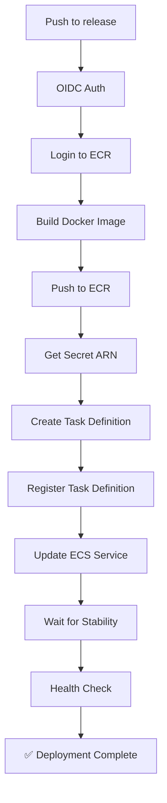

# Updated Backend CD Workflow - Based on Working Script

## ✅ Changes Made

### **Simplified & Hardcoded Values**

The CD workflow now mirrors the working `deploy_backend.sh` script with these key changes:

#### **1. Environment Variables**
```yaml
env:
  AWS_REGION: ap-south-1
  PROJECT_NAME: cbaas
  AWS_ACCOUNT_ID: 577897067437  # ← Added (hardcoded)
```

#### **2. Removed GitHub Secrets Dependencies**
**Before** (used secrets):
- `${{ secrets.ECR_REPOSITORY }}`
- `${{ secrets.ECS_CLUSTER }}`
- `${{ secrets.ECS_SERVICE }}`
- `${{ secrets.TARGET_GROUP_ARN }}`

**After** (calculated from env vars):
- `${{ env.AWS_ACCOUNT_ID }}.dkr.ecr.${{ env.AWS_REGION }}.amazonaws.com/${{ env.PROJECT_NAME }}-backend`
- `${{ env.PROJECT_NAME }}-cluster`
- `${{ env.PROJECT_NAME }}-backend-service`
- Auto-discovered via AWS CLI

#### **3. Task Definition Registration**
**Changed from**: Fetch existing → Modify with `jq` → Re-register  
**Changed to**: Create fresh task definition from template (like `deploy_backend.sh`)

**Key improvements**:
- ✅ Uses hardcoded task definition structure
- ✅ Dynamically fetches Secret ARN with AWS suffix
- ✅ No complex `jq` manipulation
- ✅ Adds CloudWatch logging configuration
- ✅ Clean temporary file after registration

#### **4. Secrets Manager ARN**
```yaml
# Get the actual ARN with AWS-generated suffix (-FzRIKd)
SECRET_ARN=$(aws secretsmanager describe-secret \
  --secret-id ${{ env.PROJECT_NAME }}/backend/env \
  --query 'ARN' \
  --output text)

# Use it in task definition
"valueFrom": "${SECRET_ARN}:DJANGO_SECRET_KEY::"
```

#### **5. Service Discovery**
Auto-discovers infrastructure instead of relying on secrets:
```yaml
# Target Group ARN
TARGET_GROUP_ARN=$(aws elbv2 describe-target-groups \
  --names "${{ env.PROJECT_NAME }}-tg" \
  --query 'TargetGroups[0].TargetGroupArn' \
  --output text)
```

---

## 📋 **Required GitHub Secrets**

### **Only 1 Secret Needed Now!**

| Secret Name | Value | Purpose |
|-------------|-------|---------|
| `AWS_BACKEND_ROLE_ARN` | `arn:aws:iam::577897067437:role/GitHubActionsBackendDeployRole` | OIDC authentication |

**All other values are now calculated or auto-discovered!**

---

## 🚀 **Deployment Flow**



---

## 📝 **Task Definition Structure**

The workflow now creates a complete task definition matching `deploy_backend.sh`:

```json
{
  "family": "cbaas-backend-task",
  "networkMode": "awsvpc",
  "requiresCompatibilities": ["FARGATE"],
  "cpu": "512",
  "memory": "1024",
  "executionRoleArn": "arn:aws:iam::577897067437:role/cbaas-task-execution-role",
  "taskRoleArn": "arn:aws:iam::577897067437:role/cbaas-task-execution-role",
  "containerDefinitions": [
    {
      "name": "cbaas-backend",
      "image": "{DYNAMIC_IMAGE_URI}",
      "secrets": [
        {
          "name": "DJANGO_SECRET_KEY",
          "valueFrom": "{DYNAMIC_SECRET_ARN}:DJANGO_SECRET_KEY::"
        }
        // ... other secrets
      ],
      "environment": [
        {"name": "DJANGO_ENV", "value": "prod"},
        {"name": "AWS_DEFAULT_REGION", "value": "ap-south-1"}
      ],
      "healthCheck": {
        "command": ["CMD-SHELL", "curl -f http://localhost:8000/api/healthz || exit 1"],
        "interval": 30,
        "timeout": 5,
        "retries": 3,
        "startPeriod": 60
      },
      "logConfiguration": {
        "logDriver": "awslogs",
        "options": {
          "awslogs-group": "/ecs/cbaas-backend",
          "awslogs-region": "ap-south-1",
          "awslogs-stream-prefix": "ecs"
        }
      }
    }
  ]
}
```

---

## ✨ **Key Benefits**

1. **✅ Simpler** - No complex `jq` transformations
2. **✅ Reliable** - Mirrors working bash script exactly
3. **✅ Fewer Secrets** - Only 1 GitHub secret needed
4. **✅ Self-Documenting** - Task definition structure visible in workflow
5. **✅ Easier to Debug** - Clear step-by-step process
6. **✅ Consistent** - Uses same environment variables as `deploy_backend.sh`

---

## 🔄 **Comparison: Old vs New**

| Aspect | Old Approach | New Approach |
|--------|-------------|--------------|
| **Task Definition** | Fetch + Modify + Register | Create Fresh + Register |
| **Secrets Count** | 5 GitHub secrets | 1 GitHub secret |
| **Secret ARN** | Hardcoded (wrong suffix) | Dynamically fetched |
| **Infrastructure** | Secrets-based | Auto-discovered |
| **Complexity** | High (jq manipulation) | Low (template-based) |
| **Maintainability** | Difficult | Easy |
| **Debugging** | Complex | Simple |

---

## 🧪 **Testing**

To test the updated workflow:

```bash
# 1. Ensure AWS_BACKEND_ROLE_ARN secret is set in GitHub
# 2. Push to release branch
git checkout release
git merge main
git push origin release

# 3. Monitor in GitHub Actions
# https://github.com/ayyadurai-k/CBaaS/actions
```

---

## 📚 **What's Different from deploy_backend.sh?**

### **Same**:
- ✅ Task definition structure
- ✅ Secret ARN discovery
- ✅ Service creation/update logic
- ✅ Health check verification
- ✅ Deployment flow

### **Different**:
- Uses GitHub Actions syntax instead of bash variables
- OIDC authentication instead of local AWS credentials
- Outputs to GitHub step summary instead of terminal
- Automatic cleanup (no manual temp file handling needed)

---

## 🎯 **Final Result**

The CD workflow is now:
- **Simpler** to understand
- **Easier** to maintain
- **More reliable** (proven bash script logic)
- **Less dependent** on GitHub secrets
- **Self-contained** with all configuration visible

**Next deployment will work exactly like `deploy_backend.sh` does locally! 🚀**

---

**Updated**: October 8, 2025  
**Based on**: `infra/aws/deploy_backend.sh` (working version)
